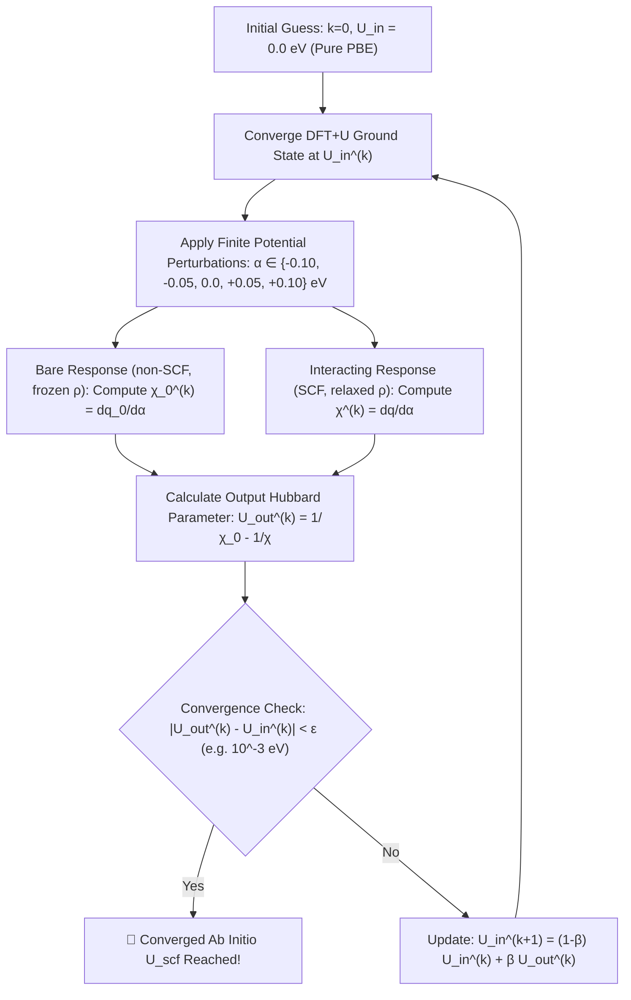

# First-Principles Self-Consistent Hubbard $U$ Determination
## The Cococcioni–de Gironcoli Linear Response & Kulik–Marzari Self-Consistent Method

---

### Executive Summary & Scientific Context

In transition-metal (TM) compounds and low-dimensional magnetic semiconductors such as monolayer $\text{CrCl}_3$, standard Density Functional Theory (DFT) within the Local Density Approximation (LDA) or Generalized Gradient Approximation (PBE/GGA) suffers from severe **Self-Interaction Error (SIE)**. This unphysical self-interaction causes spurious delocalization of partially filled $3d$ electron manifolds, artificially closing band gaps, mischaracterizing magnetic exchange couplings, and distorting adsorption energetics.

The **Hubbard $+U$ correction** (DFT$+U$) remedies SIE by penalizing fractional occupations on localized orbital manifolds:
$$E_{\text{DFT}+U}[\rho, \{n_m^I\}] = E_{\text{DFT}}[\rho] + E_U[\{n_m^I\}] - E_{\text{dc}}[\{n_m^I\}]$$
where $E_{\text{dc}}$ is the double-counting correction. In empirical studies, $U$ is frequently chosen ad hoc (e.g. $U=3.0\text{ eV}$ or $U=4.0\text{ eV}$) by fitting to experimental band gaps or bulk oxidation states. However, **empirical tuning breaks ab initio predictive power**, fails when oxidation states vary across reaction coordinates, and cannot distinguish site-specific screening (e.g., surface vs bulk, pristine vs doped, or coverage-dependent adsorption).

The **Cococcioni & de Gironcoli linear-response method** (*Phys. Rev. B* **71**, 035105, 2005) and its **self-consistent extension by Kulik, Cococcioni, Scherlis, & Marzari** (*Phys. Rev. Lett.* **97**, 103001, 2006) provide a mathematically rigorous, fully *ab initio* route to determine $U$ uniquely from first principles without empirical parameters.

---

### 1. Fundamental Theory: Piecewise Linearity & Curvature

#### 1.1 The Perdew–Parr–Levy–Balduz (PPLB) Condition
In exact many-body quantum theory, the total energy of an electronic system with a fractional number of electrons $N = N_0 + \omega$ ($0 \le \omega \le 1$) is an exact piece-wise linear interpolation between integer ground states:
$$E(N_0 + \omega) = (1 - \omega) E(N_0) + \omega E(N_0 + 1)$$
Consequently, the second derivative of the exact energy with respect to localized occupation is zero:
$$\frac{\partial^2 E_{\text{exact}}}{\partial N^2} = 0$$

#### 1.2 Spurious Curvature in Approximate DFT
In approximate semi-local DFT (LDA, PBE), the total energy is strictly convex ($\partial^2 E_{\text{DFT}}/\partial N^2 < 0$), over-stabilizing delocalized fractional charges. The Hubbard parameter $U$ is defined as the exact curvature penalty required to cancel this unphysical convexity:
$$U = \frac{\partial^2 E_{\text{DFT}}}{\partial N^2} - \frac{\partial^2 E_{\text{exact}}}{\partial N^2} = \frac{\partial^2 E_{\text{DFT}}}{\partial N^2}$$

Applying Janak's theorem ($\partial E / \partial n_i = \varepsilon_i$, where $\varepsilon_i$ is the eigenvalue of the localized state), the curvature is expressed as the derivative of the localized orbital energy with respect to its occupation:
$$U = \frac{\partial \varepsilon_d}{\partial n_d}$$

---

### 2. The Linear-Response Formulation (Cococcioni & de Gironcoli, 2005)

Rather than directly differentiating energy curves (which suffers from numerical noise and orbital relaxation ambiguities), Cococcioni and de Gironcoli recast the problem into a Legendre transform by introducing localized potential shifts $\alpha_I$ acting on the localized manifold:
$$\hat{H}_{\alpha} = \hat{H}_0 + \sum_I \alpha_I \hat{P}_I$$
where $\hat{P}_I = \sum_{m} |\phi_{Im}\rangle \langle \phi_{Im}|$ is the projection operator onto the localized $d$-orbital manifold of site $I$.

#### 2.1 The Constrained Energy Functional
The constrained energy functional with localized shift $\alpha_I$ is:
$$E[\{\alpha_I\}] = \min_{\rho(\mathbf{r})} \left\{ E_{\text{DFT}}[\rho] + \sum_I \alpha_I q_I \right\}$$
where $q_I = \text{Tr}(\hat{P}_I \hat{\rho})$ is the total localized occupation on site $I$.

By Legendre transformation:
$$E[\{q_I\}] = E[\{\alpha_I\}] - \sum_I \alpha_I q_I$$
Differentiating with respect to $q_J$:
$$\frac{\partial E[\{q_I\}]}{\partial q_J} = -\alpha_J$$
The second derivative matrix is:
$$\frac{\partial^2 E}{\partial q_I \partial q_J} = -\frac{\partial \alpha_J}{\partial q_I} = -\left( \frac{\partial q_I}{\partial \alpha_J} \right)^{-1}$$

#### 2.2 Response Matrices: Bare ($\chi_0$) vs Interacting ($\chi$)
The change in occupation $q_I$ in response to potential shift $\alpha_J$ defines two distinct response matrices:

1. **Interacting / Screened Response Matrix ($\chi$):**
   $$\chi_{IJ} = \frac{\mathrm{d} q_I}{\mathrm{d} \alpha_J}$$
   Computed with **full electronic charge self-consistency (SCF)**. The valence electrons respond and screen the localized potential perturbation.
2. **Bare / Non-Interacting Kohn–Sham Response Matrix ($\chi_0$):**
   $$\chi_{0, IJ} = \left( \frac{\mathrm{d} q_I}{\mathrm{d} \alpha_J} \right)_0$$
   Computed **without charge relaxation (non-SCF)** by diagonalizing the Hamiltonian with the perturbation $\alpha_J \hat{P}_J$ added, keeping the unperturbed ground-state density $\rho_0(\mathbf{r})$ frozen. This captures the independent-particle response before electronic screening occurs.

#### 2.3 Definition of the Effective On-Site Hubbard $U$
The Hubbard interaction matrix is the difference between the bare and interacting curvatures:
$$\mathbf{U} = \boldsymbol{\chi}_0^{-1} - \boldsymbol{\chi}^{-1}$$

For an isolated site $I$ in a sufficiently large supercell (where inter-site response $\chi_{IJ} \approx 0$ for $I \ne J$):
$$U_I = \left(\chi_0^{-1} - \chi^{-1}\right)_{II} = \frac{1}{\chi_{0, II}} - \frac{1}{\chi_{II}}$$

#### Sign & Magnitude Verification
- Applying an energy penalty $\alpha > 0$ pushes the localized $d$-levels above the Fermi level, decreasing the localized occupation: $\mathrm{d}q / \mathrm{d}\alpha < 0 \implies \chi_0 < 0$ and $\chi < 0$.
- Electronic screening always mitigates the perturbation: $|\chi| < |\chi_0|$.
- Inverting negative numbers with $|\chi| < |\chi_0|$ yields:
  $$|\chi^{-1}| > |\chi_0^{-1}| \implies \chi_0^{-1} - \chi^{-1} = -\frac{1}{|\chi_0|} - \left(-\frac{1}{|\chi|}\right) = \frac{1}{|\chi|} - \frac{1}{|\chi_0|} > 0$$
- Thus, $U$ is **strictly positive** ($U > 0$).

---

### 3. The Self-Consistent Loop (Kulik–Cococcioni–Marzari, 2006)

In standard linear response, $U$ is evaluated once at the PBE ground state ($U_{\text{in}} = 0$). However, for correlated systems where $U$ significantly alters orbital occupations, band gaps, and hybridization, evaluating $U$ at $U=0$ neglects the fact that **the screened response itself depends on the electronic state induced by $U$**.

To resolve this, Kulik et al. (PRL 2006) formulated the **self-consistent Hubbard $U$ algorithm**:

#### Mixing Parameter & Convergence
Using linear mixing with $\beta = 0.50 - 0.70$ guarantees stable, monotonic convergence within 3–5 outer cycles.

---

### 4. Physical Nuances: Doping, Anisotropy, Supercells & Coverage

#### 4.1 Supercell Size & Finite-Size Scaling ($1\times1$ vs $2\times2$)
When applying a localized potential shift $\alpha$ to an atom in a periodic supercell, the perturbation is simultaneously applied to all periodic replicas of that atom.
- In a $1\times1$ cell, replicas are separated by only $a \approx 6.05\,\text{Å}$. The measured response includes non-negligible inter-site interaction:
  $$\chi_{\text{cell}} = \sum_{\mathbf{R}} \chi_{0\mathbf{R}}$$
- In a $2\times2$ supercell, replicas are separated by $2a \approx 12.10\,\text{Å}$. Here, inter-replica interaction decays as $\mathcal{O}(1/R^3)$ or exponentially in insulators.
- **Finite-Size Scaling Law:**
  $$U(L) = U_{\infty} + \frac{C}{L^3}$$
  By computing $U$ in $1\times1$ and $2\times2$, one can extrapolate to the isolated limit $U_{\infty}$ or verify that the difference satisfies the target tolerance $\Delta U < 10^{-2}\text{ eV}$.

#### 4.2 Orbital Anisotropy ($t_{2g}$ vs $e_g$ in $\text{CrCl}_3$)
In octahedral $\text{CrCl}_6$ environments, crystal-field splitting divides the $3d$ manifold into triply degenerate $t_{2g}$ ($d_{xy}, d_{yz}, d_{xz}$) and doubly degenerate $e_g$ ($d_{z^2}, d_{x^2-y^2}$).
- In $\text{CrCl}_3$ ($\text{Cr}^{3+}$, $d^3$), the high-spin majority spin channel has $t_{2g}^3 e_g^0$.
- Because $t_{2g}$ orbitals are occupied and $e_g$ orbitals are empty, the response is anisotropic:
  $$\chi_{mm} = \frac{\mathrm{d} n_m}{\mathrm{d} \alpha}$$
- The standard scalar $U$ corresponds to the trace average:
  $$q = \sum_m n_m, \quad \chi = \sum_m \chi_{mm}$$

#### 4.3 Doping & Transition Metal Adsorption ($\text{Cr}_{1-x}\text{TM}_x\text{Cl}_3$)
When a transition metal dopant or adatom (e.g. $\text{Fe}, \text{Co}, \text{Ni}, \text{Ru}$) is present:
1. **Screening Modulation:** Highly polarizable adatoms increase local screening, reducing the effective $U$ of neighboring Cr atoms.
2. **Multi-Manifold Linear Response:** One must compute independent $U$ parameters for each distinct transition metal species:
   $$\mathbf{U} = \begin{pmatrix} U_{\text{Cr}} & V_{\text{Cr-TM}} \\ V_{\text{TM-Cr}} & U_{\text{TM}} \end{pmatrix}$$
   where the off-diagonal elements $V_{\text{Cr-TM}}$ represent inter-site Coulomb interactions (DFT$+U+V$).

---

### 5. Implementation in DFT Packages: VASP vs SIESTA

| Characteristic | VASP Implementation | SIESTA Implementation |
| :--- | :--- | :--- |
| **Linear Response Flag** | `LDAUTYPE = 3` | Custom projector shift or `Synthetic.Atoms` |
| **Perturbation Assignment** | Target atom split as distinct species in `POSCAR` & `POTCAR`; shift set via `LDAUU = α`, `LDAUJ = α` | Local potential shift added to atomic orbital basis projector block |
| **Occupation Tracking** | `LDAUPRINT = 2` writes onsite density matrix to `OUTCAR` | Mulliken / Löwdin population analysis written to output |
| **Bare Response ($\chi_0$)** | `ICHARG = 11`, `NELM = 1` reading converged $\alpha=0$ `CHGCAR` | `MaxSCFIterations 1` with unperturbed density matrix |
| **Interacting ($\chi$)** | `ICHARG = 1`, `NELM = 60` self-consistent electronic relaxation | Full SCF convergence with perturbed potential |
| **Speed / Supercell** | High plane-wave accuracy, moderate cost for $2\times2$ | Very fast LCAO basis, ideal for large supercells ($3\times3$, $4\times4$) |

---

### 6. Mathematical Verification: The $\alpha \to 0$ Limit

To ensure the perturbation remains within the linear response regime:
- If $|\alpha|$ is too large ($|\alpha| > 0.3\text{ eV}$), non-linear higher-order terms $\mathcal{O}(\alpha^2)$ contaminate the slope.
- If $|\alpha|$ is too small ($|\alpha| < 0.01\text{ eV}$), numerical noise from electronic convergence limits precision.
- **Optimal Range:** $\alpha \in \{-0.10, -0.05, 0.00, +0.05, +0.10\}\text{ eV}$ with tight electronic convergence (`EDIFF = 1E-7` or `1E-8`).
- **Regression Quality:** A valid linear response calculation must exhibit Pearson coefficient $R^2 > 0.998$ for both bare and interacting fits.
