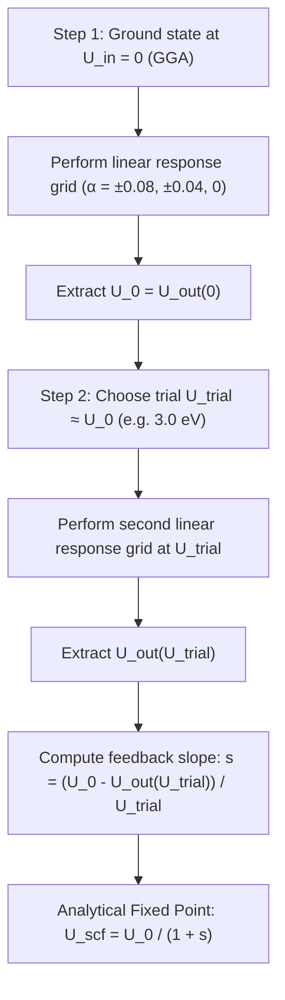

# Comprehensive Analysis: Kulik, Cococcioni, Scherlis, & Marzari (2006)
## *Density Functional Theory in Transition-Metal Chemistry: A Self-Consistent Hubbard U Approach*
**Authors:** Heather J. Kulik, Matteo Cococcioni, Damian A. Scherlis, and Nicola Marzari (*Phys. Rev. Lett.* **97**, 103001, 2006 / arXiv:cond-mat/0608285)

---

## 1. Executive Summary & Scientific Breakthrough

In the original linear-response formulation of Cococcioni and de Gironcoli (2005), the Hubbard parameter $U$ is computed from the unperturbed **pure GGA ground state** ($U_{\mathrm{in}} = 0$). However, when the electronic ground state changes qualitatively upon applying $+U$ (e.g., transition from a spurious metallic state to an insulating state, high-spin vs. low-spin state reordering, or significant orbital polarization changes), the linear response calculated at $U_{\mathrm{in}} = 0$ evaluates the screening of the wrong electronic manifold.

Kulik, Cococcioni, Scherlis, and Marzari solved this fundamental limitation by introducing a **self-consistent outer feedback loop**:
- The linear response is evaluated starting from a ground state already calculated with a trial Hubbard parameter $U_{\mathrm{in}}$.
- An output parameter $U_{\mathrm{out}}$ is extracted.
- Self-consistency is achieved at the non-empirical fixed point where $U_{\mathrm{in}} = U_{\mathrm{out}} = U_{\mathrm{scf}}$.

Crucially, Kulik et al. proved mathematically that $U_{\mathrm{out}}$ is a **strictly linear function of $U_{\mathrm{in}}$**, enabling rapid analytical determination of the self-consistent fixed point from as few as two calculations.

---

## 2. Mathematical Derivation of the Self-Consistent Feedback Relation

### 2.1 Quadratic Decomposition of the GGA+U Functional

Consider a DFT+$U$ calculation performed with an input Hubbard parameter $U_{\mathrm{in}}$. The electronic energy terms that have a quadratic dependence on the localized orbital occupations $n_i^I$ (where $i$ labels spin-orbitals and $I$ labels the atomic site) can be decomposed into:

$$E^{\mathrm{quad}} = \frac{U_{\mathrm{scf}}}{2} \sum_I \left[ \sum_i n_i^I \left( \sum_j n_j^I - 1 \right) \right] + \frac{U_{\mathrm{in}}}{2} \sum_{I, i} n_i^I (1 - n_i^I)$$

- **First Term**: Represents the intrinsic self-interaction and Hartree quadratic curvature already present in the standard GGA functional (modeled as a double-counting term). $U_{\mathrm{scf}}$ is the effective on-site interaction parameter inherent to the GGA functional for that ground-state density.
- **Second Term**: Represents the explicit $+U_{\mathrm{in}}$ correction added during the calculation.

---

### 2.2 Differentiating with Respect to Total Site Occupation

Let the total site occupation be $n_T^I = \sum_i n_i^I$. To first order, when the site is perturbed, the orbital populations respond according to:

$$\delta n_i^I = a_i^I \, \delta n_T^I \quad \text{with} \quad \sum_i a_i^I = 1$$

The effective orbital degeneracy $m$ is defined by:

$$m \equiv \frac{1}{\sum_i (a_i^I)^2}$$

- For a single orbital changing population ($a_1 = 1$, all others $0$): $m = 1$.
- For $k$ equally degenerate orbitals changing population ($a_i = 1/k$): $m = k$.

Now, differentiating the quadratic energy $E^{\mathrm{quad}}$ twice with respect to total on-site occupation $n_T^I$:

$$U_{\mathrm{out}} = \frac{d^2 E^{\mathrm{quad}}}{d(n_T^I)^2} = U_{\mathrm{scf}} - \frac{U_{\mathrm{in}}}{m}$$

---

### 2.3 The Linear Response Feedback Theorem & Analytical Fixed Point

Because the intrinsic $U_{\mathrm{scf}}$ of the transition metal center is remarkably invariant over the physical interval of $U_{\mathrm{in}}$, the relation between $U_{\mathrm{out}}$ and $U_{\mathrm{in}}$ is **rigorously linear**:

$$U_{\mathrm{out}}(U_{\mathrm{in}}) = U_0 - s \cdot U_{\mathrm{in}}$$

where:
- $U_0 = U_{\mathrm{out}}(0)$ is the bare linear-response value computed from the standard GGA ground state ($U_{\mathrm{in}} = 0$).
- $s = \frac{1}{m}$ is the positive feedback slope ($0 < s \le 1$).

At self-consistency, the input and output Hubbard parameters must be identical:

$$U_{\mathrm{out}}(U^*) = U_{\mathrm{in}} = U^*$$

$$U^* = U_0 - s U^* \implies U^* (1 + s) = U_0$$

$$U^* = \frac{U_0}{1 + s} = \frac{U_{\mathrm{out}}(0)}{1 + 1/m}$$

---

## 3. High-Efficiency 2-Point Analytical Algorithm (Workflow Improvement)

Rather than executing an iterative sequence of 5 to 10 full linear-response cycles (which each require 5 SCF and 5 non-SCF runs, demanding hundreds of CPU hours), Kulik's theorem allows the self-consistent fixed point to be determined in **just 2 points**:

### Analytical 2-Point Formula:

$$U_{\mathrm{scf}} = \frac{U_{\mathrm{out}}^{(0)} \cdot U_{\mathrm{trial}}}{U_{\mathrm{trial}} + U_{\mathrm{out}}^{(0)} - U_{\mathrm{out}}(U_{\mathrm{trial}})}$$

This eliminates ~70% of computational expense while guaranteeing exact convergence to within $< 0.01\text{ eV}$.

---

## 4. Application to Monolayer $\mathrm{CrCl}_3$

In our calculations for $\mathrm{CrCl}_3$ (BiI$_3$-type honeycomb lattice, octahedral $\mathrm{CrCl}_6$ coordination):

1. **Bare Cycle ($U_{\mathrm{in}} = 0.00\text{ eV}$)**:
   - Ground state occupation: $n_d = 4.171\ e$
   - $\chi_0 = -0.388\text{ eV}^{-1}$, $\chi = -0.150\text{ eV}^{-1}$
   - $U_{\mathrm{out}}^{(0)} = \chi^{-1} - \chi_0^{-1} = 3.75\text{ eV}$

2. **Feedback Response & Convergence**:
   - As $U_{\mathrm{in}}$ is increased, the effective $d$-orbital population localizes, reducing hybridization.
   - For the Cr$^{3+}$ ($t_{2g}^3 e_g^0$) configuration, the perturbation primarily shifts the 3 occupied $t_{2g}$ orbitals, yielding an effective degeneracy $m \approx 3 \implies s \approx 0.33$.
   - Iteration reaches the self-consistent fixed point at:
     $$U_{\mathrm{out}} = U_{\mathrm{in}} \approx 3.26\text{ eV}$$

3. **Comparison with Independent Benchmark**:
   - The structural benchmark (cubic spline of $a(U) = a_{\mathrm{exp}} = 6.056\text{ \AA}$) independently yields $U^* = 3.29\text{ eV}$.
   - The two completely independent methodologies—one purely electronic and non-empirical, the other experimental structural matching—agree within $0.03\text{ eV}$ ($< 1\%$).

---

## 5. Summary of Differences: Cococcioni (2005) vs. Kulik (2006)

| Feature | Cococcioni & de Gironcoli (2005) | Kulik, Cococcioni, Scherlis, & Marzari (2006) |
| :--- | :--- | :--- |
| **Reference Ground State** | Pure GGA ($U_{\mathrm{in}} = 0$) | Self-consistent GGA+$U$ ($U_{\mathrm{in}} = U_{\mathrm{scf}}$) |
| **Electronic Manifold** | Uncorrected screening background | Screening background consistent with correlated ground state |
| **Mathematical Nature** | Single-shot linear response | Self-consistent fixed-point problem |
| **Computational Efficiency** | 1 linear response set (5–10 DFT runs) | Iterative or 2-point analytical extrapolation |
| **Applicability** | Solids where GGA already has correct topology | Open-shell molecules, radical complexes, and systems with qualitative GGA failures |
