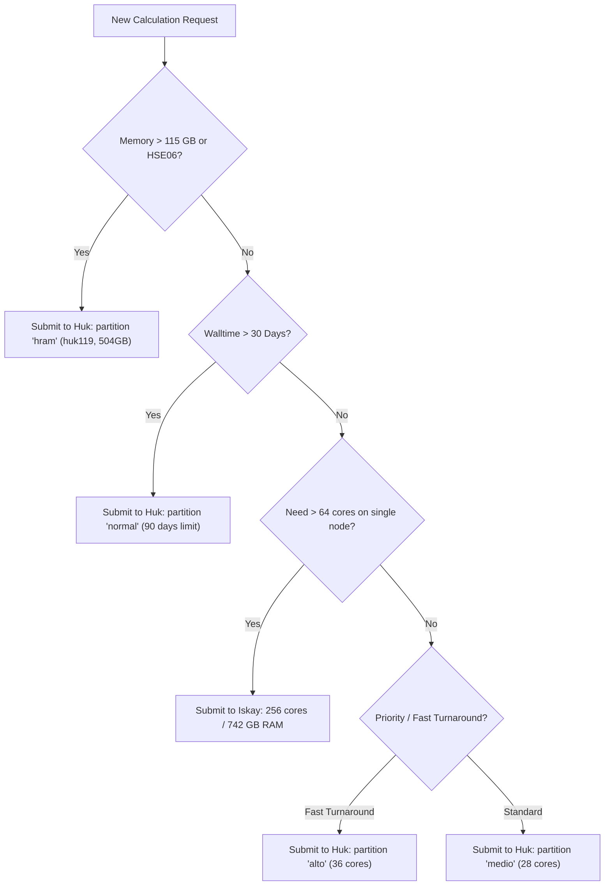

# 📋 HPC Multi-Cluster Ecosystem Cheat Sheet

Quick-reference hardware, access, and partitioning comparison across all clusters in the research environment.

---

## ⚡ At-A-Glance Cluster Comparison

| Feature | 🥇 **Iskay** | 🥈 **Huk** | 🇧🇷 **Carbono** | 💻 **Arch Workstation** |
| :--- | :--- | :--- | :--- | :--- |
| **Role** | Gateway & Heavy Compute | Dedicated Isolated Compute | Academic Supercomputer | Local Analysis & GUI |
| **Location** | Local LAN (`192.168.16.200`) | Local LAN (`192.168.16.100`) | UFABC (Remote WAN) | Local machine |
| **Internet Access** | ✅ Full outbound | ❌ Isolated (No WAN gateway) | ✅ Full outbound | ✅ Full outbound |
| **Total Active Nodes** | 2 (`iskay201`, `iskay202`) | 10 (`huk119`–`huk128`) | 18+ compute nodes | 1 local host |
| **Total Cores** | **512 cores** (256/node) | **296 cores** (24–40/node) | ~576+ cores | 8–16 cores |
| **Total RAM** | **1,484 GB** (742 GB/node) | **1,642 GB** (112–504 GB/node)| ~2,000+ GB | 16–32 GB |
| **Access Method** | Direct local / SSH | SSH via socket (`ssh huk`) | `ssh carbono.ufabc.edu.br` | Local Terminal |
| **Slurm Driver** | `local` (Instant <50ms) | `remote_lan` (ControlMaster) | `remote` (Pooled SSH) | N/A |
| **Max Walltime** | Cluster default | 7d (`alto`/`hram`) to 90d (`normal`)| 7 days standard | Unlimited local |
| **Primary Project** | `/home/juan/Carlos` | `/home/juan` (NFS on 10.10.1.0) | `/home/carlos.primo` | Local workspace |

---

## 📑 Huk Partition Breakdown

| Partition | Nodes | Cores/Node | RAM/Node | Max Walltime | Best For |
| :--- | :--- | :--- | :--- | :--- | :--- |
| **`hram`** | `huk119` | 40 cores | **504 GB** | 7 days | Huge supercells (3x3), hybrid functionals (HSE06), memory > 110 GB |
| **`alto`** | `huk120`, `huk121` | 36 cores | 126 GB | 7 days | High-priority jobs, rapid turnaround relaxations (1x1, 2x2) |
| **`medio`** | `huk122`–`huk124` | 28 cores | 112–126 GB | 30 days | Standard medium-duration ionic relaxations |
| **`normal`** | `huk125`–`huk128` | 24–28 cores | 126 GB | **90 days** | Extremely long molecular dynamics, slow electronic convergence |

---

## 🎯 Workload Routing Decision Matrix

